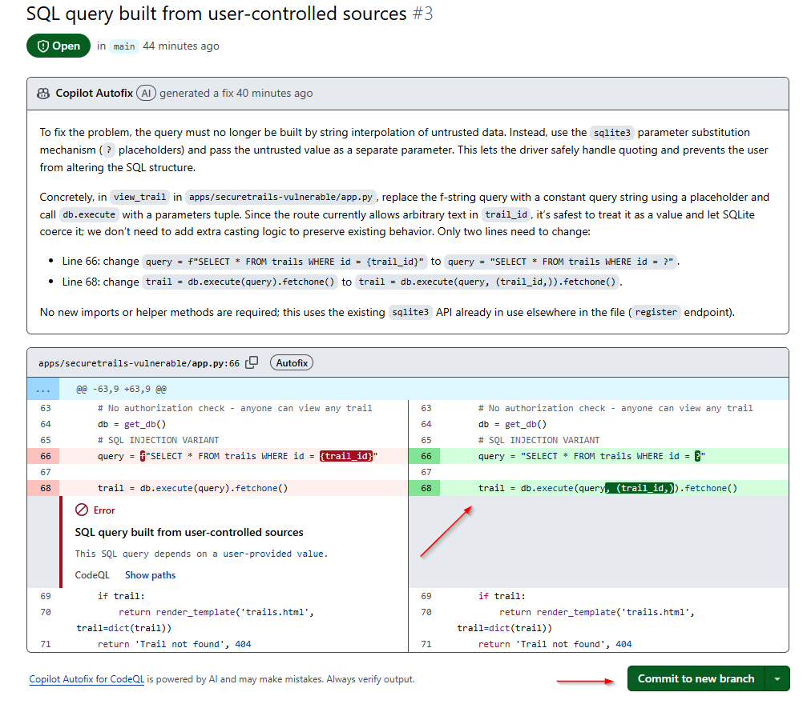
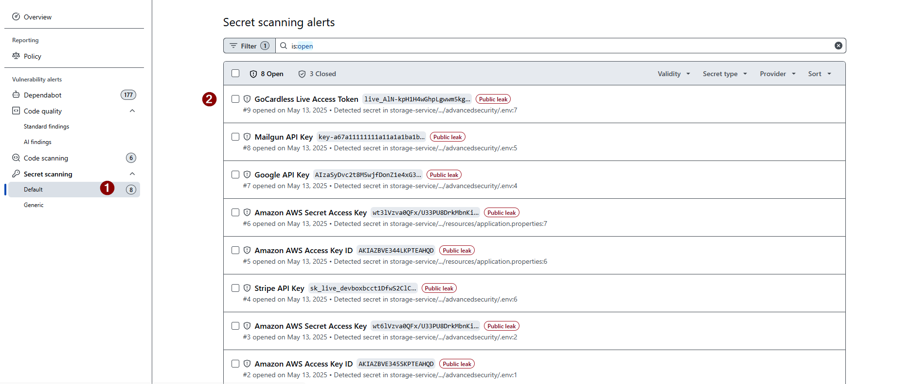

# Exercise 1: GitHub NATIVE Security (GHAS)
## What GitHub Provides Out-of-the-Box

**Duration**: 20 minutes  
**Type**: ⭐⭐ Understanding GitHub's native capabilities  
**Focus**: GitHub Advanced Security - Built-in scanning without custom tools

---

## 🎯 Learning Objectives

✅ Understand what GitHub GHAS provides   
✅ Enable CodeQL for static analysis  
✅ Review Secret Scanning results  
✅ Understand Dependabot vulnerability alerts  
✅ See real vulnerabilities BEFORE you write custom tools  

---

## 📖 Scenario

**Question**: "Is SecureTrails ready for launch?"

**Without writing ANY custom code**, GitHub can already tell us about:
- Code vulnerabilities (SQL injection, XSS) via CodeQL
- Hardcoded secrets via Secret Scanning  
- Vulnerable dependencies via Dependabot
- Security misconfigurations

This exercise shows what GitHub **NATIVELY** provides.

---

## 🏛️ What is GitHub Advanced Security (GHAS)?

GHAS includes THREE built-in security **SERVICES**:

| Feature | What It Does | Type | Where It Runs |
|---------|--------------|------|----------------|
| **CodeQL** | Finds code vulnerabilities (SQL injection, XSS, etc.) | GitHub Native Service | GitHub servers |
| **Secret Scanning** | Detects hardcoded API keys, passwords, tokens | GitHub Native Service | GitHub servers |
| **Dependabot** | Identifies vulnerable packages | GitHub Native Service | GitHub servers |


---

## ⚙️ Step 1: Enable Security Features via Settings

### Step 1.1: Go to Repository Settings

In your GitHub repository, click **Security** tab:


**You'll see:**
- Vulnerability alerts overview
- Links to enable security features

---

### Step 1.2: Navigate to Security settings

Scroll down in Settings sidebar to **Advanced Security** section:

**Click**: "Advanced Security" → You'll see available security features


Toggle ON all these features:


**Enable:**
- ☑ Dependabot alerts
- ☑ Dependabot security updates  
- ☑ Code scanning with CodeQL
- ☑ Secret scanning
- ☑ Push protection (blocks secrets in commits)

Once enabled, GitHub starts scanning automatically.

---

## 🔍 Step 2: Enable Code Quality (Preview)

### Step 2.1: Open Settings → Code quality (preview) is a new GitHub feature that provides code quality insights alongside security findings.
**Enable Code Quality (Preview)** to get additional insights on code maintainability and potential bugs.


---

### Step 3: View Code Scanning Results

Click **Code scanning** in the left menu:


**You'll see:**
- List of vulnerabilities found by CodeQL
- Severity levels (CRITICAL, HIGH, MEDIUM, LOW)
- File locations and line numbers
- Recommendations for each finding

---

### Real Findings in SecureTrails

CodeQL has found vulnerabilities in the app:


Copilot autofix suggestions:


```
**Your task:** Click each finding to understand:
- Why it's a vulnerability
- Where exactly it occurs
- What the recommended fix is
```
once copilot autofix suggestions are available, review them to understand how GitHub GHAS can even suggest fixes for code vulnerabilities and merge them if you want to.




### 🔍 Step 4: View Secret Scanning Results

Similarly, click **Secret scanning** in the left menu: 

And you'll see any hardcoded secrets found in the codebase:


---

## 📋 Step 6: Create Issues from Findings

GitHub can auto-create issues for each finding. Or manually:

```bash
# Create an issue documenting all GHAS findings
gh issue create \
  --title "[SECURITY] GitHub GHAS findings - SecureTrails" \
  --label "security,review" \
  --body "## Security Analysis Results (GitHub Native)

### CodeQL Findings
- SQL Injection (app.py:47) - CRITICAL
- XSS in templates (templates/trails.html:89) - HIGH  
- Weak password hashing (app.py:200) - MEDIUM

### Secret Scanning
- GitHub PAT in .env.example - CRITICAL
- AWS credentials in app.py - CRITICAL
- DB password exposed - CRITICAL

### Dependabot Alerts
- Flask 1.1.0: 2 CVEs (CRITICAL)
- requests 2.24.0: 1 CVE (MEDIUM)
- SQLAlchemy 1.3.0: 1 CVE (HIGH)

**Assessment**: NOT PRODUCTION READY
- 3 critical code vulnerabilities
- 3 hardcoded secrets  
- 3 vulnerable packages

**Next Steps**:
1. Fix code vulnerabilities (CodeQL findings)
2. Remove hardcoded secrets and use .env
3. Update vulnerable packages to secure versions
4. Proceed to Exercise 2 for interactive analysis"
```

---

## ✅ Acceptance Criteria

- [ ] **Step 1.1**: Located Settings tab in repository
- [ ] **Step 1.2**: Found "Security and analysis" in settings sidebar
- [ ] **Step 1.3**: Enabled all security features (Dependabot, CodeQL, Secret scanning, Push protection)
- [ ] **Step 2.1**: Navigated to Security tab and viewed dashboard
- [ ] **Step 2.2**: Viewed Code scanning results
- [ ] **Step 3**: Reviewed CodeQL findings - found ≥3 code vulnerabilities
- [ ] **Step 4**: Reviewed Secret Scanning - found ≥3 hardcoded secrets
- [ ] **Step 5**: Reviewed Dependabot alerts - found ≥3 vulnerable packages
- [ ] **Step 6**: Created GitHub issue documenting all findings
- [ ] **Understanding**: Can explain what each GHAS service does (CodeQL, Secret Scanning, Dependabot)

---

## 🎯 Key Learning

**What GitHub GHAS Found in SecureTrails:**

✅ **9+ Security Issues** without writing ANY custom code:
- 3 code vulnerabilities (SQL injection, XSS, weak crypto)
- 3 hardcoded secrets (GitHub PAT, AWS keys, DB password)
- 3+ vulnerable packages (Flask, requests, SQLAlchemy)

**GitHub provides this FOR FREE** on enterprise/org repos or DEFAULT on public repos.

This is why starting here matters - **understand native capabilities before building custom**.

---

## 🚀 Exercise 1 Complete!

You now understand:
- ✅ What GitHub GHAS provides natively
- ✅ How to enable and view security findings
- ✅ The difference between code vulns, secrets, and dependency issues
- ✅ That SecureTrails has real security problems to fix

**Next: Exercise 2** - Use Copilot CLI for interactive analysis and fixing

---

## 📚 Resources

- [GitHub Advanced Security Docs](https://docs.github.com/en/enterprise-cloud@latest/code-security)
- [CodeQL Documentation](https://codeql.github.com/)
- [Dependabot Alerts](https://docs.github.com/en/code-security/dependabot)
- [Secret Scanning](https://docs.github.com/en/code-security/secret-scanning)

---

**⏱️ Time**: 20 min | **Exercises**: 1/5 ✓
