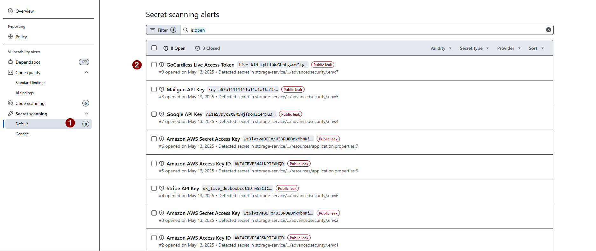
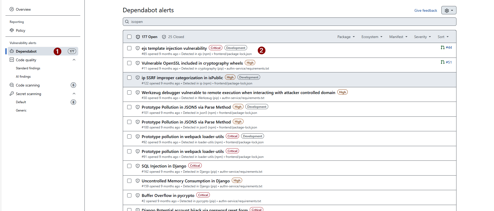

# Exercise 05 — Review Secret Scanning & Dependabot

**Duration**: 5 minutes
**Copilot Feature**: GitHub Native Security (GHAS)
**Goal**: Identify hardcoded secrets and vulnerable dependencies detected by GitHub's built-in scanners.

---

## Background

Secret Scanning detects credential patterns (API keys, tokens, passwords) committed to the repository. Dependabot cross-references your `requirements.txt` against a public CVE database. Both run automatically as part of GHAS — this exercise reads their output and creates a tracking issue for remediation.

---

## Step 1 — Review Secret Scanning Alerts

In GitHub, go to **Security → Secret scanning**. You will see alerts for secrets committed in the codebase.

Common findings for SecureTrails:
- `config.py` — hardcoded `SECRET_KEY`
- `config.py` — hardcoded database password

For each alert, note the **secret type**, **file**, and **line**.

> **Tip**: Even if a secret is in a private repo, treat it as compromised and rotate it immediately.



---

## Step 2 — Review Dependabot Alerts

Go to **Security → Dependabot alerts**. For each vulnerable package, note:
- Package name and pinned version
- CVE identifier
- Severity (Critical / High / Medium)
- Patched version available

SecureTrails uses intentionally old versions — you should see alerts for Flask, requests, and SQLAlchemy.



---

## Step 3 — Create a Tracking Issue with Copilot

Open Copilot Chat and paste:

```
I need to create a consolidated GitHub issue to track all GHAS findings for the SecureTrails repository.
Include sections for: CodeQL findings (SQL injection, XSS, weak hashing), Secret scanning (hardcoded SECRET_KEY and DB password), and Dependabot (Flask, requests, SQLAlchemy CVEs).
Format it as a GitHub issue body with checkboxes for each item and a priority label suggestion.
```

Use the generated body to create the issue:

```bash
gh issue create \
  --title "[SECURITY] GHAS findings — SecureTrails remediation tracker" \
  --label "security" \
  --body "<paste Copilot output here>"
```

---

## Verify

- [ ] Secret scanning shows at least one hardcoded credential alert
- [ ] Dependabot shows at least two vulnerable package alerts
- [ ] Tracking issue created in the repository with finding checkboxes
- [ ] You know the patched versions for Flask and requests

---

## Key Takeaway

> Secret Scanning and Dependabot provide zero-effort detection; a single consolidated issue keeps all findings visible and prioritised for the team.

---

**Next**: [Exercise 06 — Copilot CLI Interactive Analysis](exercise-06-copilot-cli-analysis.md)
